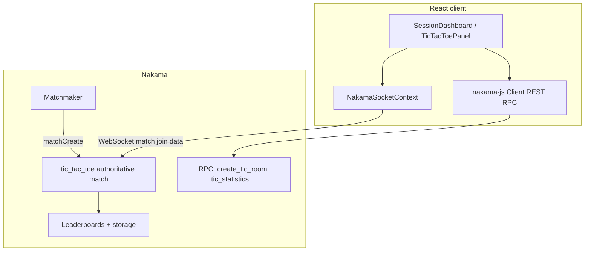

# Lila — Multiplayer Tic-Tac-Toe (Nakama)

Server-authoritative tic-tac-toe with React + TypeScript frontend and Nakama 3.x (JavaScript runtime). This repo maps to the **LILA full-stack assignment** rubric below.

---

## Assignment checklist

### Frontend

| Requirement | Status |
|-------------|--------|
| Preferred stack (React) | ✅ |
| Responsive UI (mobile-friendly breakpoints, touch targets) | ✅ |
| Real-time game state updates (WebSocket match data) | ✅ |
| Player information & match status (opponent name, phase, timed countdown) | ✅ |

### Backend (Nakama) — core

| Requirement | Status |
|-------------|--------|
| Server-authoritative game logic (authoritative match handler) | ✅ |
| Validate moves server-side (`matchLoop`) | ✅ |
| Prevent client cheating (state only from server snapshots) | ✅ |
| Broadcast validated state (op code 1 snapshots) | ✅ |
| Create game rooms (`create_tic_room` RPC + stable `match_id`) | ✅ |
| Automatic matchmaking (classic & timed pools) | ✅ |
| Join by match id + host flow | ✅ |
| Graceful disconnect / reconnect (forfeit, rejoin hint, resync opcode) | ✅ |
| **Deployment** (cloud Nakama + public frontend + deployment docs) | ☐ *Not included — see [Deployment](#deployment) below* |

### Optional (bonus)

| Requirement | Status |
|-------------|--------|
| Concurrent games / room isolation (one match per `match_id`; many matches server-wide) | ✅ |
| Leaderboard (wins, losses, streaks, rating +4/−1, top 5, persistence) | ✅ |
| Timer mode (30s/turn, timeout forfeit, matchmaker `classic` vs `timed`, UI countdown) | ✅ |

### Deliverables

| Item | Status |
|------|--------|
| Source repository | ✅ (this repo) |
| Public game URL / mobile app | ☐ *Host per [Deployment](#deployment)* |
| Public Nakama endpoint | ☐ *Host per [Deployment](#deployment)* |
| README: setup & install | ✅ |
| README: architecture & design | ✅ |
| README: deployment process | ⚠️ *Outline only — production deploy not performed here* |
| README: API / server configuration | ✅ |
| README: how to test multiplayer | ✅ |

---

## Prerequisites

- **Node.js** 20+ (or compatible) for the frontend and Nakama runtime build  
- **Docker** + Docker Compose (for Postgres + Nakama locally)  
- **npm**

---

## Quick start (local)

### 1. Nakama + Postgres

From the `nakama` folder:

```bash
cd nakama
docker compose up -d
```

- **HTTP / gRPC API:** `http://127.0.0.1:7350`  
- **Console (default):** `http://127.0.0.1:7351` — create a user or use device/email auth from the app  
- Default **server key** (dev): `defaultkey` (see Nakama docs if you change it)

### 2. Build the JavaScript runtime (required)

The container mounts [`nakama/runtime`](nakama/runtime) and loads [`local.yml`](nakama/local.yml) → `build/index.js`.

```bash
cd nakama/runtime
npm install
npm run build
```

Restart Nakama after runtime changes:

```bash
cd nakama
docker compose restart nakama
```

### 3. Frontend

```bash
cd frontend
cp .env.example .env
# Edit .env: VITE_NAKAMA_HOST, VITE_NAKAMA_PORT, VITE_NAKAMA_SERVER_KEY, VITE_NAKAMA_USE_SSL
npm install
npm run dev
```

Open the URL Vite prints (e.g. `http://localhost:5173`).

Production build:

```bash
npm run build
npm run preview   # optional local static test
```

---

## Architecture & design



- **Authoritative match** (`tic_tac_toe` in [`nakama/runtime/src/main.ts`](nakama/runtime/src/main.ts)): holds board, phase, turn, marks, timed deadlines; validates moves in `matchLoop`; sends JSON snapshots on op code **1**; moves on op code **2**; optional resync on op code **3**.  
- **Client** ([`frontend/src/nakama/NakamaSocketContext.tsx`](frontend/src/nakama/NakamaSocketContext.tsx)): matchmaker or `joinMatch(matchId)`; applies snapshots to React state.  
- **Rooms:** `create_tic_room` creates a match; host/guest join by id; quick match uses separate **classic** vs **timed** matchmaker queries.  
- **Persistence:** leaderboards (`tic_wins`, `tic_losses`, `tic_rating`), storage (`tic_stats` profile, `tic_match_log` history).  
- **Session:** short JWT + long refresh in [`nakama/local.yml`](nakama/local.yml); client restores session from `localStorage`.

---

## Configuration

| Setting | Location | Notes |
|--------|----------|--------|
| API key | `frontend/.env` → `VITE_NAKAMA_SERVER_KEY` | Must match Nakama `socket.server_key` / console |
| Host / port | `VITE_NAKAMA_HOST`, `VITE_NAKAMA_PORT` | Default `127.0.0.1` / `7350` |
| TLS | `VITE_NAKAMA_USE_SSL` | `true` when page and Nakama are both HTTPS/WSS |
| DB | `nakama/docker-compose.yml` | Postgres `nakama` / password `localdb` (local only) |
| Runtime bundle | `nakama/local.yml` | `runtime.path`, `js_entrypoint: build/index.js` |
| Matchmaker tick | `nakama/local.yml` | `matchmaker.interval_sec: 2` (local convenience) |

---

## Deployment

**This repository does not include a finished cloud deployment.** For the assignment deliverable you would typically:

1. **Nakama** — Run Nakama (+ Postgres) on a VM or managed service; set `database.address`, `socket.server_key`, TLS certificates; mount or bake the compiled `nakama/runtime/build/index.js`; expose **7350** (and **7351** for console if needed, restricted).  
2. **Frontend** — Build static assets (`npm run build`), host on Netlify / Vercel / S3+CloudFront / etc.; set production `VITE_*` to your **public** Nakama URL and enable `VITE_NAKAMA_USE_SSL=true` when using HTTPS.  
3. **CORS / security** — Configure Nakama allowed origins; never expose the master console key in the client; use a **socket** key appropriate for game clients.

Document your actual URLs, env vars, and any reverse proxy (e.g. nginx) in a short `DEPLOY.md` or extend this README once deployed.

---

## How to test multiplayer (local)

1. Start **Docker Compose** and **runtime build** (see above), then **Vite dev server**.  
2. Open **two browser windows** (or normal + incognito) to the same app URL.  
3. Register/login as **two different users** (or two devices on the same LAN pointing at your machine’s IP in `.env`).  
4. **Quick match** — Both click *Quick match* (or *Quick match (timed)* for timed pool); wait for pairing (~2s interval locally).  
5. **Private room** — User A: *Create room* → share/copy **Room id** → User B: paste in *Match id to join* → *Join*.  
6. **Moves** — Only the active player’s clicks apply; observe board and status sync.  
7. **Disconnect** — Close one tab mid-game: other side should see win/forfeit per server rules.  
8. **Leaderboard / Statistics** — Play decisive games; open **Leaderboard** on home and **Statistics** from the avatar menu.

---

## Project layout

| Path | Role |
|------|------|
| [`frontend/`](frontend/) | Vite + React app |
| [`nakama/runtime/src/main.ts`](nakama/runtime/src/main.ts) | Match logic, RPCs, leaderboards |
| [`nakama/docker-compose.yml`](nakama/docker-compose.yml) | Local Postgres + Nakama |
| [`nakama/local.yml`](nakama/local.yml) | Nakama config (session, matchmaker, runtime path) |

---

## License

Provided for evaluation / assignment purposes unless otherwise specified by the author.
